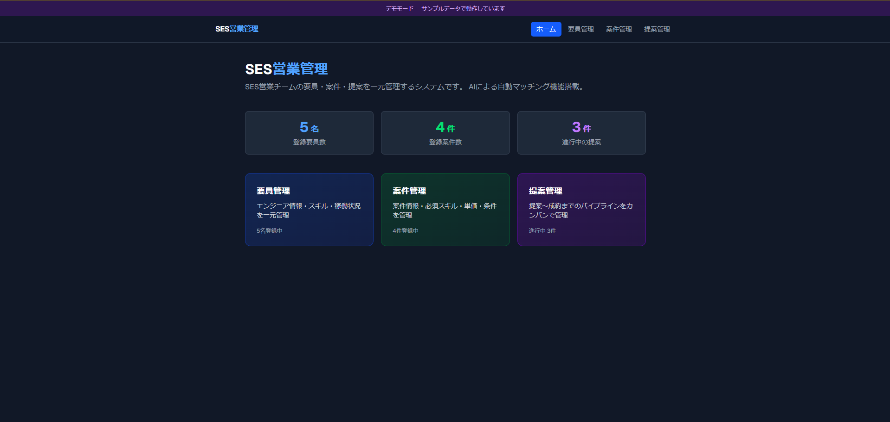
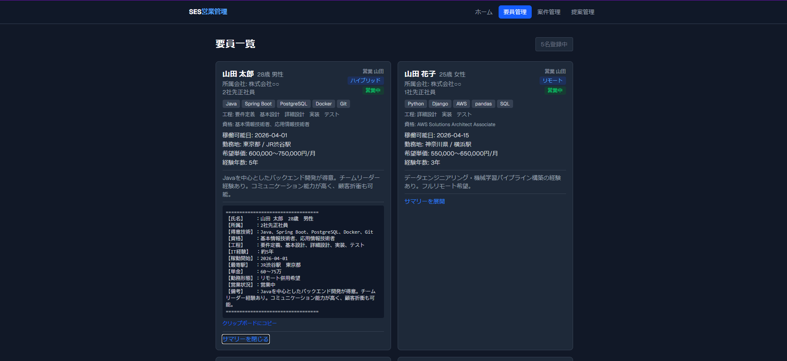
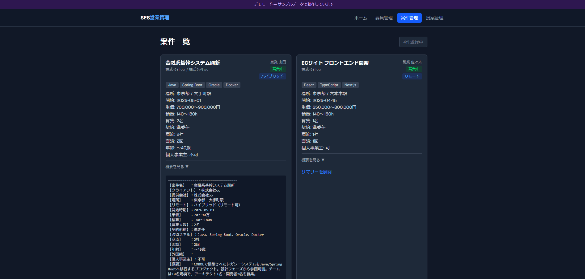
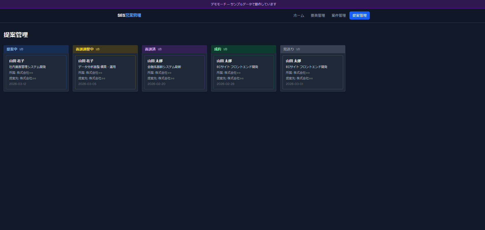

# SES営業管理システム

SES営業チームの**要員・案件・提案を一元管理**するWebアプリケーションです。
OpenAI APIを活用したAIマッチング機能により、案件に最適なエンジニアを自動でスコアリングします。

## デモ

**[▶ デモを見る](https://ses-kanri-m7qn.vercel.app/demo)**  
※ サンプルデータで動作しています。ログイン不要。

## 主な機能

- **要員管理** — エンジニアのスキル・稼働状況・希望単価・スキルシートを一元管理
- **案件管理** — 案件の必須スキル・単価・勤務条件等を登録・管理
- **AIマッチング** — OpenAI APIで案件に合う要員を自動スコアリング・ランキング表示
- **提案管理** — 要員×案件の提案をカンバン形式で管理（提案中 → 面談調整中 → 面談済 → 成約）
- **スキルシート管理** — PDF / Excel のスキルシートをアップロード・ダウンロード
- **認証** — メールアドレス・パスワードによるログイン機能

## 技術スタック

| カテゴリ | 技術 |
|---|---|
| フロントエンド | Next.js 16 (App Router) / TypeScript / Tailwind CSS |
| バックエンド | Next.js API Routes |
| データベース | Supabase (PostgreSQL) |
| 認証 | Supabase Auth |
| ストレージ | Supabase Storage |
| AI | OpenAI API |
| デプロイ | Vercel |

## スクリーンショット

### ダッシュボード


### 要員一覧


### 案件一覧


### 提案管理（カンバン）


## ローカル起動

```bash
git clone https://github.com/zzz0max0612-beep/ses-kanri.git
cd ses-kanri
npm install
```

`.env.local` を作成して以下を設定：

```
NEXT_PUBLIC_SUPABASE_URL=your_supabase_url
NEXT_PUBLIC_SUPABASE_ANON_KEY=your_supabase_anon_key
OPENAI_API_KEY=your_openai_api_key
```

```bash
npm run dev
```

`http://localhost:3000` で起動します。
